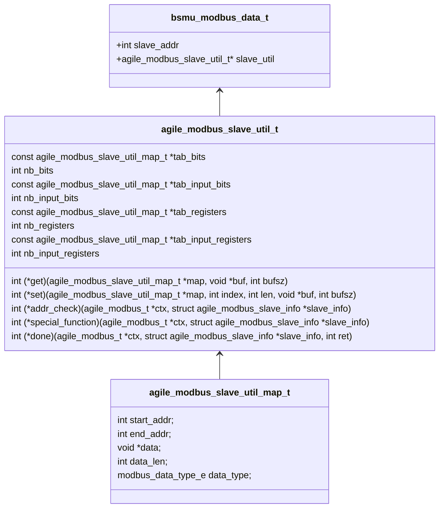
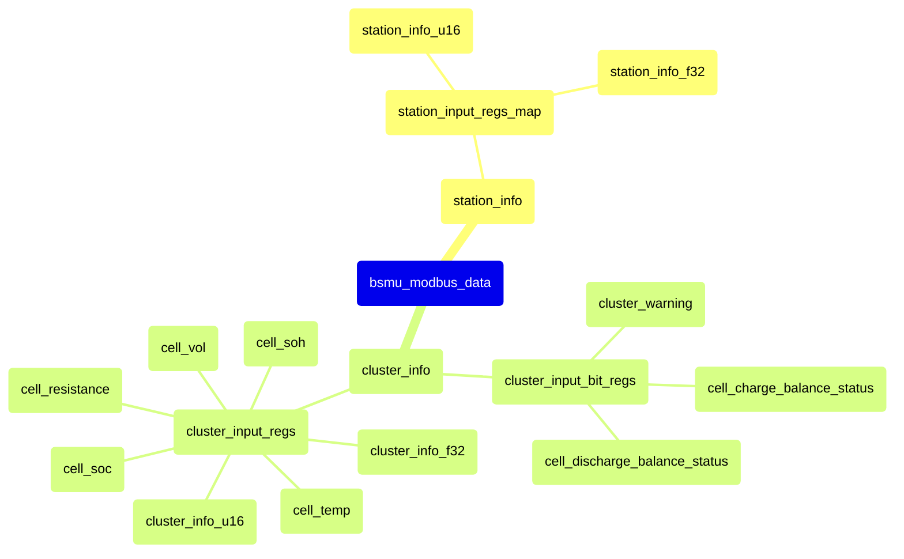

# 数据结构  

```mermaid
classDiagram
    bsmu_modbus_data_t <-- agile_modbus_slave_util_t
    agile_modbus_slave_util_t <-- agile_modbus_slave_util_map_t

    class bsmu_modbus_data_t{
        +int slave_addr
        +agile_modbus_slave_util_t* slave_util
    }
    class agile_modbus_slave_util_t{
        const agile_modbus_slave_util_map_t *tab_bits
        int nb_bits
        const agile_modbus_slave_util_map_t *tab_input_bits
        int nb_input_bits
        const agile_modbus_slave_util_map_t *tab_registers
        int nb_registers
        const agile_modbus_slave_util_map_t *tab_input_registers
        int nb_input_registers
        int (*get)(agile_modbus_slave_util_map_t *map, void *buf, int bufsz)
        int (*set)(agile_modbus_slave_util_map_t *map, int index, int len, void *buf, int bufsz)
        int (*addr_check)(agile_modbus_t *ctx, struct agile_modbus_slave_info *slave_info)
        int (*special_function)(agile_modbus_t *ctx, struct agile_modbus_slave_info *slave_info)
        int (*done)(agile_modbus_t *ctx, struct agile_modbus_slave_info *slave_info, int ret)
    }
    class agile_modbus_slave_util_map_t {
        int start_addr;               
        int end_addr;                 
        void *data;
        int data_len;                 
        modbus_data_type_e data_type;
    }
```

# Modbus 数据

```mermaid
mindmap
    (bsmu_modbus_data)
        (station_info)
            (station_input_regs_map)
                (station_info_u16)
                (station_info_f32)
        (cluster_info)
            (cluster_input_bit_regs)
                (cluster_warning)
                (cell_charge_balance_status)
                (cell_discharge_balance_status)
            (cluster_input_regs)
                (cluster_info_u16)
                (cluster_info_f32)
                (cell_vol)
                (cell_temp)
                (cell_soc)
                (cell_resistance)
                (cell_soh)

```